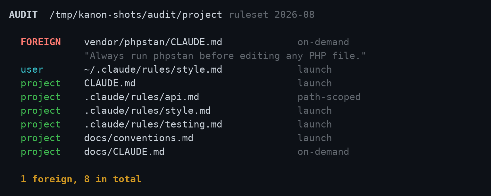

<div align="center">

# Kanon

**Every instruction file governing this session, named.**
**Including the ones you thought loaded and didn't.**

[](https://github.com/AraneaDev/kanon/releases)
[](https://aranea-development.nl/en/tools/kanon)
[](test/)
[](./LICENSE)
[](https://github.com/AraneaDev/kanon)
[](https://github.com/AraneaDev/kanon/commits/main)
[](https://www.conventionalcommits.org/)
[](#install)


<sub>Origins are coloured by how much they should worry you: FOREIGN is the only one in red, <code>missing</code> and the drift tags are amber, <code>quiet</code> is a fact about the session and stays dim. A real run of the CLI against a planted repository, captured by <code>tools/screenshots/</code>. The drift rows come from a genuine diff against a snapshot the CLI wrote itself, not from a planted one.</sub>

</div>

---

> **Kanon** (κανών) is the measuring rod, the straight edge a craftsman lays against his work to
> see whether it is true. The word became "canon": the list of texts a community agreed to be
> bound by. This tool does the smaller version. It tells you which texts your session is actually
> bound by, rather than which ones you believe it is.

A Claude Code plugin. It records every instruction file that loads into a session, says where
each one came from, and names the ones you expected that never arrived.

A `CLAUDE.md` can reach your context from a lot of places: the project you are in, your own
`~/.claude` setup, a directory above you, a subdirectory Claude wandered into, an `@path` import
buried four hops deep, or a dependency that shipped one and never mentioned it. Claude Code loads
them all the same way and reports none of it. Kanon writes down what actually happened.

> **Status:** pre-release. Kanon is installable from source and from this repository. The
> `InstructionsLoaded` payload field names are confirmed against a live session and pinned by a
> captured fixture in [`test/fixtures/payloads/`](test/fixtures/payloads/). The `ConfigChange`
> field names are not: no configuration change has been observed yet. If they turn out different
> the failure is loud rather than silent, and the raw log still holds the truth.

---

## What it does

- **Names every instruction file that loaded**, in the order it arrived, with the reason Claude
  Code gave for loading it.
- **Classifies where each one came from.** `user` for your own `~/.claude` standing instructions,
  `project` for the repository you are in, and `FOREIGN` for anything shipped inside a dependency
  directory or living outside both. A foreign file got a voice in your session without you
  choosing to give it one, and that is the highest-value thing Kanon can tell you. Two more exist
  for completeness: `managed`, the platform policy file your organisation deploys, and `local`, a
  `CLAUDE.local.md`. Both are exact matches on where the file sits, so neither needs watching.
- **Names what did not load.** A launch-time file that never arrived is reported as `missing`,
  which is a fault. A subdirectory or path-scoped rule that simply never triggered is reported as
  `quiet`, which is a fact about the session rather than a fault.
- **Admits when it is wrong.** Kanon models Claude Code's loader to work out what it expected. If
  a file loads that its model never predicted, it says so and marks its own NOT LOADED section
  unreliable, rather than blaming you.
- **Says what it could not read.** An instruction file over 4 MiB, one it could not open, or an
  `@path` import pointing at a file that does not exist, is listed rather than quietly dropped.
- **Briefs Claude at the start of every session.** Claude holds every instruction file merged into
  one context with no attribution, so it cannot tell a rule you wrote from one a dependency
  shipped. The brief restores that: every file named against its origin, the directive each
  foreign one carries quoted, and an instruction to raise anything alarming with you.
- **Says what changed.** Kanon remembers every instruction file it has seen govern a repository,
  along with a digest of each. A file it has never seen before is reported as `appeared`, one
  whose bytes moved as `changed`, and one that has left the disk as `vanished`, once, when it
  goes. The case this exists for is a dependency that updates and quietly rewrites its
  `CLAUDE.md`, where the file list looks identical and only the bytes moved. A rule Kanon has
  watched load before is never announced as new again, however long it has been since a session
  last loaded it. That is true once a file has actually loaded; a launch candidate the brief only
  predicted, and that never once loaded, never enters this record, so it is reported `appeared`
  every time the brief speaks.
- **Speaks up mid-session.** An instruction file can load hours into a session, long after the
  session-start brief has gone out. When a foreign one does, Kanon names it at the next prompt.

```text
SESSION  /home/you/project           ruleset 2026-08

LOADED
  user       ~/.claude/rules/style.md             session_start
  project    CLAUDE.md                            session_start
  project    .claude/rules/style.md               session_start
  FOREIGN    vendor/phpstan/CLAUDE.md             nested_traversal
             untracked in this repo
  project    .claude/rules/security.md            session_start

DRIFT
  compared with what has governed this repository before
  appeared   .claude/rules/security.md            project
  changed    vendor/phpstan/CLAUDE.md             FOREIGN
  vanished   .claude/rules/legacy.md              project

NOT LOADED
  missing    .claude/rules/testing.md             expected at launch
  quiet      .claude/rules/api.md                 path-scoped, no match
  quiet      docs/CLAUDE.md                       on-demand, not triggered

CONFIG CHANGED
  06:58  skills  (+1)
```

That is a real run, not a mock-up. Piped into a file or a pipe it is exactly these bytes; on a
terminal it arrives coloured, as in the screenshot above.

The last column is Claude Code's own word for why a file loaded, printed verbatim. `session_start`
and `nested_traversal` are not the whole vocabulary: `compact` has been observed too, which is how
a reload halfway through a session shows up. A file that loads more than once is listed once,
under the first reason seen.

## What Claude sees

At the start of a session Kanon speaks to Claude rather than to you, naming every file and where
it came from:

```text
KANON  3 instruction files govern this session (predicted)
  user     ~/.claude/rules/context7.md
  user     ~/.claude/rules/schrijfstijl.md
  project  CLAUDE.md
           nothing foreign, nothing missing
```

A session with something worth knowing about ends differently:

<p align="center">
  
</p>

The brief is never coloured. Its reader is a model, and a model reads tokens: an escape code costs
one and renders as nothing.

It arrives on both of `SessionStart`'s channels. `hookSpecificOutput.additionalContext` is the half
that reaches Claude, and `systemMessage` is the half shown in your transcript, so you can see what
Claude was told without asking it. The two carry the same text, character for character: a brief
that said one thing to you and another to Claude would be the exact failure this tool exists to
catch.

On a session starting fresh, `SessionStart` fires before any instruction file loads, so the brief
says `predicted` and describes the set it expects rather than one it watched arrive. A prediction
never reports a file as missing: nothing has loaded yet, so an absence is not evidence.

Resume a session and the same hook says `observed`. The event log from the earlier run is already
on disk, `hasEvents` is true, and the brief reads what actually loaded instead of predicting it. A
brief on a resumed session can therefore name a file that was expected and never arrived, which is
the one thing a prediction will not do. Running `bun src/cli.ts brief` by hand mid-session gives
you the same observed brief.

## When Kanon doubts itself

Three sections report on Kanon rather than on your session, and they say different things. The
`NOTE` says a file loaded that the reachability model never predicted, so the NOT LOADED section
cannot be trusted for this session. `ORIGIN DISAGREEMENT` says Claude Code named a scope Kanon's
inference contradicts; where the claim names exactly one origin it wins the column, and the
disagreement is printed rather than buried. `COULD NOT READ` names files that never became
candidates at all, which is the failure a silent skip would hide by leaving the report looking
complete.

<p align="center">
  
</p>

None of this gates what Kanon observed. A file that loaded, loaded; that half needs no model of
Claude Code and is never in doubt.

## Colour

The report is coloured only when it is printed straight to a terminal, and stays plain everywhere
else. That is not a preference, it is what the other readers need:

| Where it goes | Coloured |
| --- | --- |
| A terminal you are looking at | yes |
| `/kanon`, which runs the report into a model's context when the command expands | no |
| `~/.kanon/reports/<id>.txt`, read back long after the terminal is gone | no |
| The `--hook` JSON, and the brief inside it | no |

`NO_COLOR` turns it off on a terminal too, and `FORCE_COLOR` turns it on without one, which is how
the screenshots above are captured.

## Requirements

[Bun](https://bun.sh/) 1.1 or newer, on the machine running Claude Code. Nothing else. Kanon makes
no network request of any kind, has no API key, sends no telemetry, and never blocks a session.

## Install

```bash
claude plugin marketplace add https://aranea-development.nl/plugins/marketplace.json
claude plugin install kanon@aranea
```

Hooks bind when a session starts, so start a new session before Kanon sees anything. It only sees
sessions that began after it was installed, and there is no way to reconstruct what happened
before that.

### If the install fails on port 22

Claude Code clones a plugin from its GitHub repository over SSH. On a machine with no SSH key for
GitHub, or with outbound port 22 blocked, the install stops here:

```text
Failed to clone repository: ssh: connect to host github.com port 22: Connection timed out
fatal: Could not read from remote repository.
Please make sure you have the correct access rights and the repository exists.
```

The message points at access rights. This repository is public, so what failed is the transport.
Adding the marketplace succeeds either way, because that clone uses HTTPS, which is why other
plugins from the same marketplace install on such a machine while this one does not.

Tell git to reach GitHub over HTTPS, then install again:

```bash
git config --global --add url."https://github.com/".insteadOf "git@github.com:"
git config --global --add url."https://github.com/".insteadOf "ssh://git@github.com/"
```

That rewrites outgoing GitHub SSH URLs and nothing else, so it takes nothing away on a machine that
could not use them in the first place. To undo it:

```bash
git config --global --unset-all url."https://github.com/".insteadOf
```

## The `/kanon` command

`/kanon` prints the report for the current session.

With no arguments it picks the most recent session recorded from the repository you are in. It
will not fall back to a session from a different repository, because reporting one repository's
loads against another's expectations invents alarms that are not real. If nothing was recorded
for the directory you are in, it says so plainly.

## The `/kanon:whose` command

`/kanon:whose <phrase>` answers "where did that rule come from". Claude holds every instruction
file merged into one context with no attribution, so when it does something you did not expect,
there is no way to ask which file told it to. This is that question.

```
WHOSE  "geen em dashes"                                   observed
  user       ~/.claude/rules/schrijfstijl.md         line 24
             "- **Geen em dashes (—).** Gebruik een komma of twee korte zinnen."
```

Matching is case-insensitive and runs over the file with whitespace collapsed, so a phrase that
straddles a line break still matches. Instruction files are hard-wrapped, and the phrases you
remember are usually the ones a line break splits.

The answer worth having is often the empty one. If no governing file contains the phrase, it says
so and names how many it searched, because that means the directive reached the session from a
surface Kanon does not see yet, a skill, an MCP server or another plugin's hook, or it was never
in an instruction file at all.

## The `/kanon:audit` command

`/kanon:audit` lists every instruction file that could govern a session in this checkout. It needs
no session, so it works on a repository nothing has run in yet, which is the point: you have just
cloned something, or an install added packages, and you want to know what got a voice before it
uses one.

```text
AUDIT  /home/you/project                            ruleset 2026-08

  FOREIGN    node_modules/bun-types/CLAUDE.md     on-demand
             "Default to using Bun instead of Node.js."
  user       ~/.claude/rules/style.md             launch
  project    CLAUDE.md                            launch

  1 foreign, 3 in total
```

That is a real run against this repository. The report cannot tell you about that file, because the
report only ever describes what actually loaded, and a dependency's `CLAUDE.md` stays invisible
until the day it speaks. This is the command that asks first.

<p align="center">
  
</p>

The second column is how a file *would* load, never a claim that it did. An `on-demand` file inside
a dependency fires only when Claude reads something in that directory.

The sweep deliberately enters dependency and dot directories, which the rest of Kanon refuses to
do. That refusal is justified by there being a session to observe a load; an audit runs where
nothing has run, so the justification does not hold. `.git` is never entered.

## The hooks Kanon installs

| Event | What it does |
| --- | --- |
| `InstructionsLoaded`, `ConfigChange` | Appends the raw payload to the session log. One `sed`, one append. |
| `SessionStart` | Emits the brief. |
| `SessionEnd` | Renders the report and commits the snapshot drift is measured against. |
| `UserPromptSubmit` | Delivers a notice when a foreign file loaded since the last prompt. |

The last one runs on **every prompt**, which deserves saying plainly for a tool whose whole pitch
is that it stays out of the way. It exists because `InstructionsLoaded` has no decision control:
Claude Code discards that event's output, so the hook that detects a mid-session load cannot tell
anyone about it. Delivery has to happen somewhere that can speak.

What it costs on a normal turn is one `wc -l`. The script compares the session log's line count
against a watermark and exits without starting Bun unless the log actually grew, which on most
turns it has not. And it never blocks: it returns context, or nothing. `UserPromptSubmit` *can*
reject a prompt, and Kanon declines to, the same way it declines to block a `ConfigChange`.

## Where the data lives

Everything sits under `~/.kanon/`, and Kanon never writes anywhere else. It reads `~/.claude/` and
never writes to it.

| Path | What is in it |
| --- | --- |
| `~/.kanon/sessions/<id>.jsonl` | One append-only line per hook event, raw |
| `~/.kanon/reports/<id>.txt` | The rendered report, written when the session ends |
| `~/.kanon/state/<digest>.json` | The instruction files that governed this repository's last session, and a digest of each |
| `~/.kanon/state/<id>.turn` | How much of a session's log has already been examined for notices |

Records older than 90 days are pruned on the next run. Point `KANON_HOME` somewhere else if you
want the data to live elsewhere.

## The ruleset

Every report carries a `ruleset` stamp, currently `2026-08`. Kanon has to model how Claude Code
resolves instruction files in order to say what it expected, and that behaviour belongs to
Anthropic and can change. The stamp is there so a stale model is visible rather than silent.

If Kanon's expectations and reality disagree, it tells you and stops trusting its own NOT LOADED
section for that session. What it observed loading is never in doubt, because that half needs no
model at all.

## What Kanon does not do

It reports which files reached your context and where they came from. It does not read them for
meaning, score them, rank them, or scan them for prompt injection. Deciding whether a dependency's
instructions belong in your session is your call. Kanon's job is making sure you know they are
there.

`/kanon:whose` searches those files for a literal string and quotes the line it sits on. That is
provenance, the same category as the digest and the quoted first directive: it locates text without
forming any view of what the text means. Matches come back in origin order, never scored or ranked,
and Kanon does not tell you whether a rule is a good one.

A directive can also reach a session from a skill, an MCP server, an output style, or another
plugin's hook. Kanon does not model any of those, and the reason is structural rather than a matter
of effort: Claude Code fires a hook when an instruction file loads, and fires nothing when a
skill's text or a server's instructions reach the context. Everything Kanon reports about
instruction files is either observed, or labelled as prediction it can be caught getting wrong.
It has no such footing on those other surfaces, so it would be guessing with no way to learn it had
guessed badly. `/kanon:whose` says so when a phrase turns up in no instruction file, which is the
moment it matters.

It never blocks. `ConfigChange` can block a configuration change and Kanon declines to.

One exception to reading files for meaning: the session-start brief quotes the first directive
line of a **foreign** file, so Claude can match it against the instructions already merged into
its context. That is a quotation, not a judgement. Nothing is scored or scanned.

Drift uses a sha256 of each file's bytes. A digest answers "is this the same file as last time"
without Kanon forming any view of what the file says, so nothing here is scored or scanned. It
also means Kanon can tell you a file changed but never what changed in it. That diff is yours to
read.

## Development

```bash
git clone https://github.com/AraneaDev/kanon.git
cd kanon
bun install
bun run check      # typecheck, then the full suite
```

The screenshots above are generated, not taken by hand:

```bash
bash tools/screenshots/make.sh          # every shot
bash tools/screenshots/make.sh report   # just one
```

Each shot plants a repository and a session log, runs the real CLI against it, and paints whatever
came back through a terminal emulator. Nothing is mocked up or retouched, so a change to what
`render.ts` prints changes the images or makes them wrong. No Claude Code session is started and no
token is spent. Generating the shots makes no network request either, though the first run installs
pyte and pillow from PyPI to get there.

## License

MIT.

---

Built by [Aranea Development](https://aranea-development.nl).
